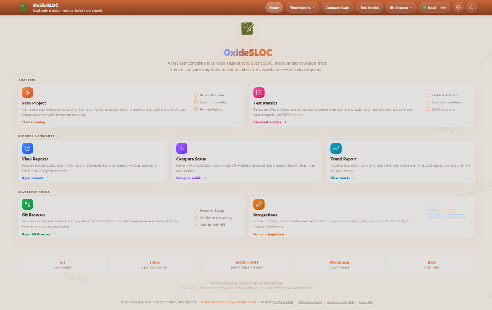
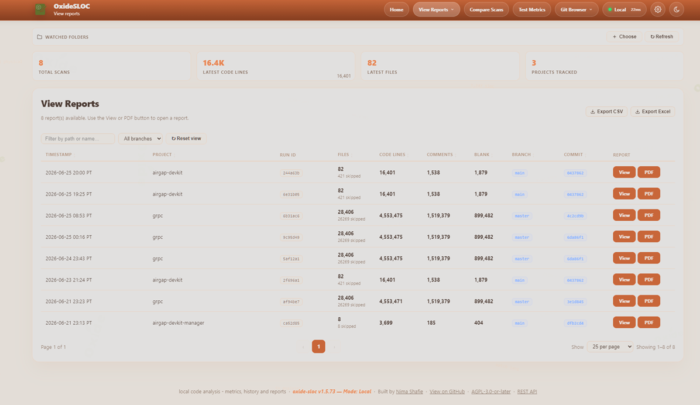
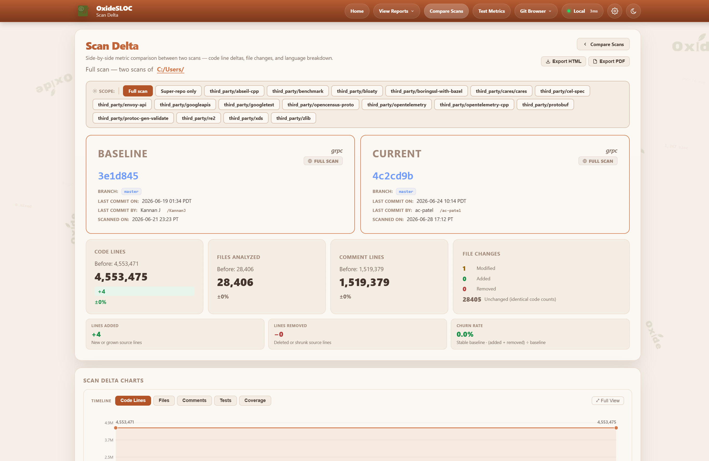
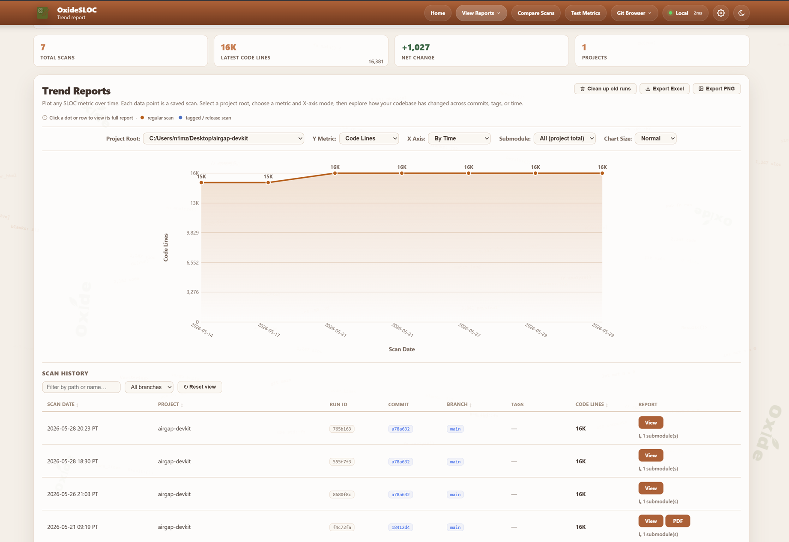
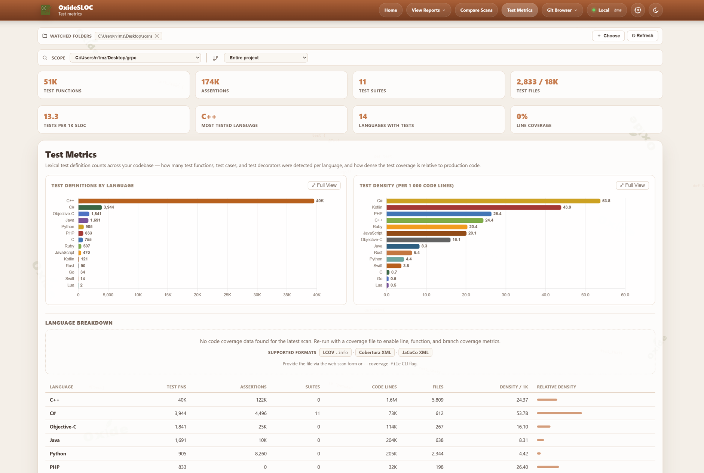
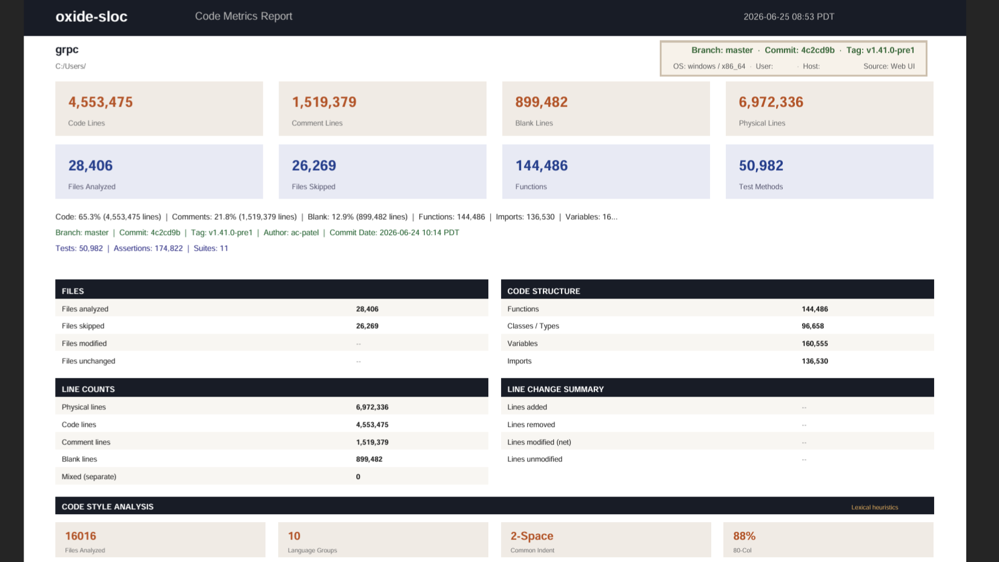
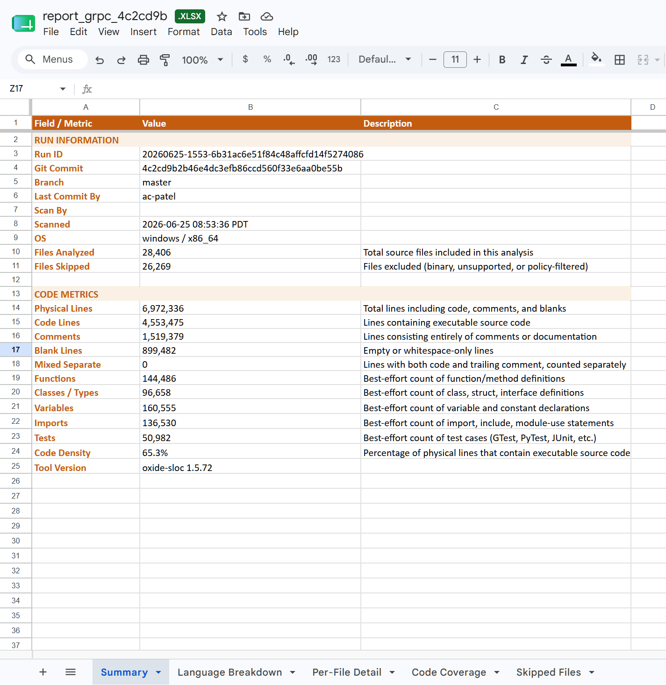
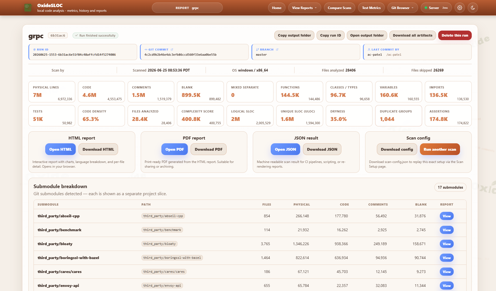

# oxide-sloc

<!--
  Badges load live status from GitHub/shields/codecov when online. On an
  air-gapped machine the live fetch fails and the browser's onerror handler
  swaps in a committed static SVG from docs/badges/ instead of a broken image.
  (GitHub strips onerror during sanitization, but GitHub is online, so the live
  badge renders there regardless.) Refresh the fallbacks with
  scripts/internal/gen-offline-badges.ps1 after a version bump.
-->
<a href="https://github.com/oxide-sloc/oxide-sloc/actions/workflows/ci.yml"></a>
<a href="https://github.com/oxide-sloc/oxide-sloc/actions/workflows/release.yml"></a>
<a href="https://github.com/oxide-sloc/oxide-sloc/actions/workflows/docker.yml"></a>
<a href="https://github.com/oxide-sloc/oxide-sloc/releases/latest"></a>
<a href="https://crates.io/crates/oxide-sloc"></a>
<a href="https://codecov.io/gh/oxide-sloc/oxide-sloc"></a>
<a href="./LICENSE"></a>
<a href="https://www.bestpractices.dev/en/projects/12976"></a>
<a href="https://securityscorecards.dev/viewer/?uri=github.com/oxide-sloc/oxide-sloc"></a>
<a href="https://docs.rs/oxide-sloc"></a>
<a href="./mcp.json"></a>

**oxide-sloc** is a Rust-based local code analysis tool — IEEE 1045-1992 SLOC analysis, unit test detection, and coverage reporting.

## Quick Start

```bash
bash scripts/run.sh   # installs on first run, then opens http://127.0.0.1:4317
```

On **Windows with no Git Bash**, use the native-PowerShell installer instead — it needs
no bash (see [Windows without Git Bash](#windows-without-git-bash)):

```powershell
powershell -ExecutionPolicy Bypass -File scripts\internal\install.ps1
.\oxide-sloc.exe serve
```

| Platform | What happens |
|---|---|
| **Windows 10/11** (Git Bash) | `bash scripts/run.sh` — extracts the pre-built binary from `dist/`, or builds offline |
| **Windows 10/11** (no Git Bash) | `powershell -File scripts\internal\install.ps1` — native, no bash; extracts `dist/` or builds fully offline (needs a MinGW linker) |
| **Linux — Rust installed** | Builds offline from the committed `vendor.tar.gz.*` parts |
| **Linux — no Rust, toolchain committed** | Bootstraps Rust from `toolchain/` archives, builds offline |
| **Linux — online** | `bash scripts/internal/install.sh --online` downloads the release binary |
| **Air-gapped** | See [`docs/airgap.md`](./docs/airgap.md) |

## Features

- **CLI + web UI** — `analyze / report / diff / serve / send / init` commands; guided 4-step web flow with Quick Scan
- **IEEE 1045-1992 physical SLOC** — configurable mixed-line, continuation-line, compiler-directive, and blank-in-comment policies; symbol counting (functions, classes, variables, imports)
- **Deep metrics** — COCOMO I effort/cost estimate, approximate cyclomatic complexity (branch-keyword count), ULOC / DRYness, and duplicate-file detection on every run
- **Git Hotspots** — ranks refactor candidates by `code lines × commit activity` over a configurable window (90 days by default); per-file commit counts and last-changed dates from a single `git log` pass
- **Code Ownership** — per-author line attribution via `git blame`; contributor leaderboard, per-author file drill-down, hotspot ownership, and `.mailmap` identity merge/export; on by default
- **Test Metrics** — lexical test function detection across 60 languages; test-to-code density; multi-format coverage import (LCOV, Cobertura XML, JaCoCo XML, coverage.py JSON, Istanbul/NYC JSON)
- **Flexible output** — HTML reports, PDF, CSV, and 4-sheet Excel export; re-render any saved JSON
- **Git integration** — branch/tag/commit browser (remote URLs *and* local checkouts), recursive submodule scanning, GitHub/GitLab/Bitbucket webhooks and polling, submodule breakdown
- **CI/CD** — GitHub Actions, Jenkins, GitLab CI; native Jira + Bitbucket + Confluence publishing; JSON metrics API, SVG badge endpoint, embeddable widget, SMTP/webhook delivery
- **Offline-first** — vendored deps, Chart.js compiled in, no CDN calls; Docker on GHCR; LAN server mode with API key auth and optional TLS

## Why oxide-sloc vs cloc / tokei / scc / UCC?

| Capability | oxide-sloc | cloc | tokei | scc | UCC |
|---|---|---|---|---|---|
| Languages | 60 | 250+ | 240+ | 240+ | ~30 |
| Web UI + HTML/PDF reports | ✓ | — | — | — | — |
| MCP server (AI agent tools) | ✓ | — | — | — | — |
| Test function detection | ✓ | — | — | — | — |
| Trend / history tracking | ✓ | — | — | — | — |
| Coverage file import | ✓ | — | — | — | — |
| Git Hotspots (churn × size) | ✓ | — | — | — | — |
| Code ownership (git-blame attribution) | ✓ | — | — | — | — |
| COCOMO + complexity¹ + DRYness | ✓ | — | — | ✓ | partial |
| IEEE 1045-1992 compliance | ✓ | partial | — | — | partial |
| REST API + SVG badge | ✓ | — | — | — | — |
| Git webhook integration | ✓ | — | — | — | — |
| CI/CD marketplace action | ✓ | — | — | — | — |
| Offline / air-gapped build | ✓ | — | — | — | — |

¹ Complexity is a lexical approximation — a sum of branch/decision keywords (`if`, `for`, `while`, `||`, `&&`, …) per code line, not a control-flow-graph McCabe computation.

cloc, tokei, and scc win on raw language count and throughput for pure line-counting
pipelines; UCC (USC's Unified Code Count) brings rigorous physical/logical SLOC counting,
cyclomatic complexity, and two-baseline differencing from an academic lineage. oxide-sloc is
the right choice when you need analysis depth, visual reports, history, or AI-native
integration — particularly as an MCP tool callable by Claude, Copilot, and other agents.

---

## Screenshots



| View Reports | Scan Delta |
|---|---|
|  |  |
| **Trend Reports** | **Test Metrics** |
|  |  |
| **PDF Report** | **Excel Export** |
|  |  |



---

## Installation

### Package managers

| Manager | Command | Platform |
|---|---|---|
| **winget** | `winget install NimaShafie.OxideSLOC` | Windows |
| **Chocolatey** | `choco install oxide-sloc` | Windows |
| **Scoop** | `scoop bucket add oxide-sloc https://github.com/oxide-sloc/scoop-oxide-sloc && scoop install oxide-sloc` | Windows |
| **Homebrew** | `brew tap oxide-sloc/oxide-sloc && brew install oxide-sloc` | macOS / Linux |
| **Nix** | `nix run github:oxide-sloc/oxide-sloc` | Linux / macOS |
| **cargo** | `cargo install oxide-sloc --locked` | Any |
| **DEB / RPM** | Download from [Releases](https://github.com/oxide-sloc/oxide-sloc/releases) | Ubuntu / RHEL |

### Docker

A container image is published to the GitHub Container Registry on every push to `main` and
every release tag:

```bash
docker pull ghcr.io/oxide-sloc/oxide-sloc:latest
```

Tags: `latest` (current `main`), a minor series (e.g. `1.6`), and exact versions (e.g. `1.6.20`).

**Web UI** — the image runs `serve --server` by default, binding `0.0.0.0:4317`. Server mode is
fail-closed, so provide an API key (sent as `Authorization: Bearer <key>`):

```bash
docker run --rm -p 4317:4317 \
  -e SLOC_API_KEY=$(openssl rand -hex 32) \
  ghcr.io/oxide-sloc/oxide-sloc:latest
# then open http://localhost:4317
```

For a quick throwaway trial on a trusted local machine, opt out of auth explicitly:

```bash
docker run --rm -p 4317:4317 \
  -e SLOC_ALLOW_UNAUTHENTICATED=1 \
  ghcr.io/oxide-sloc/oxide-sloc:latest
```

**CLI** — append a subcommand to override the default and mount the repo read-only:

```bash
docker run --rm -v /path/to/your/repo:/repo:ro \
  ghcr.io/oxide-sloc/oxide-sloc:latest analyze /repo --plain
```

**docker compose** (builds the image locally):

```bash
export SLOC_API_KEY=$(openssl rand -hex 32)
docker compose up
```

Set `SLOC_ALLOWED_ROOTS` and `SLOC_TLS_CERT`/`SLOC_TLS_KEY` as needed; for PDF export in a
container without `SYS_ADMIN`, add `-e SLOC_BROWSER_NOSANDBOX=1`. See
[`docs/server-deployment.md`](./docs/server-deployment.md).

### Windows without Git Bash

The bash launchers (`run.sh` / `install.sh`) need Git Bash. On a locked-down or
air-gapped Windows host where you cannot install Git for Windows,
use the native-PowerShell installer — it reproduces the full offline flow
(checksum-verify → reassemble split parts → extract with the built-in `tar.exe` →
bootstrap the bundled toolchain → `cargo build --release --offline`) using only tools
that ship with Windows 10/11:

```powershell
powershell -ExecutionPolicy Bypass -File scripts\internal\install.ps1
# flags: -Rebuild (fresh compile), -Build (compile even if dist\ exists),
#        -MingwBin <dir>, -SkipDist
```

If a pre-built binary is committed in `dist\`, it is extracted and no build runs. For a
source build, the **one** requirement PowerShell cannot supply is a C linker: the bundled
toolchain targets `x86_64-pc-windows-gnu`, which links with MinGW `gcc`/`ld`. The
installer auto-locates it from a **PortableGit** folder (a no-install extract),
`-MingwBin <dir>`, `$env:SLOC_MINGW_BIN`, or a `gcc` already on PATH:

```powershell
# Stage a portable Git Bash once (no installer) — provides both the
# bash.exe for CI and the mingw64\bin linker for the native build:
powershell -ExecutionPolicy Bypass -File ci\jenkins\stage-portable-git.ps1 PortableGit-2.47.0-64-bit.7z.exe
$env:SLOC_PORTABLE_GIT = 'C:\Tools\PortableGit'   # only if staged outside the workspace
```

For running the **Jenkins pipeline** on a Windows agent without a system Git install, see
the Windows-agents section of [`docs/ci-integrations.md`](./docs/ci-integrations.md).

---

## Usage

### CLI

```bash
# Analyze — common forms
oxide-sloc analyze ./my-repo                            # colored summary
oxide-sloc analyze ./my-repo --plain                    # machine-readable key=value (CI-friendly)
oxide-sloc analyze ./my-repo -j out.json -H out.html -c out.csv -x out.xlsx
oxide-sloc analyze ./my-repo --per-file
oxide-sloc analyze ./my-repo --fail-on-warnings --fail-below 10000
oxide-sloc analyze ./my-repo --enabled-language rust --enabled-language python
oxide-sloc analyze ./my-repo --submodule-breakdown
oxide-sloc analyze ./my-repo --per-file --activity-window 90    # Git Hotspots (0 disables)
oxide-sloc analyze ./my-repo --per-file --attribution           # Code Ownership via git blame (on by default; --no-attribution skips)
oxide-sloc analyze ./my-repo --coverage-file lcov.info          # attach test coverage into the report
oxide-sloc analyze ./my-repo --max-complexity 15 --no-duplicates # gate on complexity (exit 6); drop duplicate files

# Other commands
oxide-sloc report result.json -H report.html --pdf-out report.pdf
oxide-sloc diff baseline.json current.json -j delta.json
oxide-sloc serve                                        # http://127.0.0.1:4317
oxide-sloc init                                         # creates .oxide-sloc.toml
oxide-sloc send result.json --smtp-to team@example.com --smtp-host smtp.example.com
oxide-sloc healthz                                      # probe a running server (Docker HEALTHCHECK)
```

Run `oxide-sloc <command> --help` for the full flag list.

### Web UI

```bash
oxide-sloc serve   # → http://127.0.0.1:4317
```

A guided 4-step flow: select project → counting rules → outputs → review & run. **Quick Scan** submits from step 1 with all defaults. Reports include a ranked **Git Hotspots** table (when run against a git repo) alongside the SLOC, complexity, and COCOMO breakdowns.

Additional pages: **Test Metrics** (`/test-metrics`), **Trend Reports** (`/trend-reports`), **Compare Scans** (`/compare-scans`), **Code Ownership** (`/code-ownership`) for per-author blame attribution and the contributor leaderboard, **Integrations** (`/integrations`) for webhook and Jira/Bitbucket/Confluence setup, and the **Git Browser** (`/git-browser`) for scanning any branch, tag, or commit — from a remote URL or a local checkout, with recursive submodule support.

### Configuration

```bash
oxide-sloc init    # generates .oxide-sloc.toml with all options documented inline
```

IEEE 1045-1992 counting parameters — `mixed_line_policy`, `continuation_line_policy`, `blank_in_block_comment_policy`, `count_compiler_directives` — are configurable via TOML or CLI flags. CLI flags always override config file values.

---

## Supported Languages (60)

Ada, Assembly, Awk, C, C++, C#, Clojure, CMake, Crystal, CSS, D, Dart, Dockerfile, Elixir, Elm, Erlang, F#, Fortran, GLSL/HLSL, Go, GraphQL, Groovy, Haskell, HCL/Terraform, HTML, Java, JavaScript, Julia, Kotlin, Lisp/Scheme, Lua, Makefile, Nim, Nix, Objective-C, OCaml, Pascal/Delphi, Perl, PHP, PowerShell, Protocol Buffers, Python, R, Ruby, Rust, Scala, SCSS/Sass, Shell, Solidity, SQL, Svelte, Swift, Tcl, TypeScript, Verilog/SystemVerilog, VHDL, Visual Basic, Vue, XML/SVG, Zig.

> TOML, Markdown, and YAML are intentionally not supported — no meaningful SLOC metric applies.

---

## Metrics API

| Endpoint | Description |
|---|---|
| `GET /api/metrics/latest` | Metrics for the most recent scan |
| `GET /api/metrics/:run_id` | Metrics for a specific run |
| `GET /api/project-history?path=<dir>` | Scan history for a project root |
| `GET /badge/:metric` | SVG badge (`code-lines`, `files`, `comment-lines`, `blank-lines`) |
| `GET /embed/summary` | Embeddable HTML widget |
| `GET /healthz` | Plain-text liveness probe (`ok`) |
| `GET /readyz` | Readiness probe (200 ready / 503 when the registry or output dir is not writable) |
| `GET /api/health` | Structured health JSON (status, version, git SHA, build time, uptime, dependency checks) |
| `GET /api/version` | Version + build provenance (git short SHA, RFC-3339 build time) |

Full OpenAPI 3.1 spec: `GET /api/openapi.yaml` or [`docs/openapi.yaml`](./docs/openapi.yaml).

```markdown

```

---

## CI/CD

| Platform | File |
|---|---|
| GitHub Actions | `ci/sloc-github-action.yml` — copy to `.github/workflows/` |
| GitHub Marketplace | `uses: NimaShafie/oxide-sloc@main` (see [`action.yml`](./action.yml)) |
| Jenkins | `testing/examples/jenkins/Jenkinsfile` |
| GitLab CI | `ci/sloc-gitlab.yml` — include via `include:` |
| Bitbucket Pipelines | `testing/examples/bitbucket/bitbucket-pipelines.yml` |
| Azure Pipelines | `testing/examples/azure/azure-pipelines.yml` |

**Marketplace action:**

```yaml
- uses: NimaShafie/oxide-sloc@main
  id: sloc
  with:
    path: .
    html-out: sloc-out/report.html
- run: echo "Code lines ${{ steps.sloc.outputs.code-lines }}"
```

For Jenkins/GitLab setup, native Jira / Bitbucket / Confluence publishing, and artifact repository integration, see [`docs/ci-integrations.md`](./docs/ci-integrations.md).

To scan repositories hosted on **different git instances** than the tool/pipeline (e.g. tooling on `bitbucket.instance1.com`, code on `bitbucket.instance2.com`) — with per-host credentials, corporate proxy/VLAN support, and air-gapped offline import — across local, server, and Jenkins modes, see [`docs/multi-instance.md`](./docs/multi-instance.md).

---

## Editor & Build Integrations

Run oxide-sloc reports without leaving your editor or build:

| Integration | Location | What it does |
|---|---|---|
| VS Code extension | [oxide-sloc-vscode](https://github.com/oxide-sloc/oxide-sloc-vscode) | Analyze the workspace or a file, view HTML reports, and see a live code-line count in the status bar. |
| Visual Studio extension | [oxide-sloc-visual-studio](https://github.com/oxide-sloc/oxide-sloc-visual-studio) | VS 2022 VSIX: analyze the solution or a selected item, a metrics tool window, and HTML report/web UI commands. |
| CMake module | [`cmake/OxideSloc.cmake`](./cmake/OxideSloc.cmake) | `include(OxideSloc)` + `oxide_sloc_add_report(...)` adds a report target with exit-code build gating. |
| CMake example | [`examples/cmake/`](./examples/cmake/) | A runnable sample project wiring the module in. |

See [`docs/ide-integrations.md`](./docs/ide-integrations.md) for setup, settings, and the exit-code table.

---

## LAN Server

```bash
bash scripts/serve-server.sh              # open, prints every LAN address
bash scripts/serve-server.sh --with-auth  # generates a session key, requires login
```

See [`docs/server-deployment.md`](./docs/server-deployment.md) for persistent deployments, TLS, and firewall configuration.

---

## Development

```bash
cargo fmt --all -- --check
cargo clippy --workspace --all-targets -- -D warnings
cargo build --workspace
cargo test --workspace
cargo run -p oxide-sloc -- serve    # http://127.0.0.1:4317
```

---

## Repository Layout

```
crates/
  sloc-cli/         # CLI entry point and commands (binary: oxide-sloc)
  sloc-config/      # Config schema and TOML parsing
  sloc-core/        # File discovery, decoding, aggregation, delta engine, COCOMO/hotspots
  sloc-git/         # Git CLI wrappers, webhook parsing, scan-schedule store
  sloc-languages/   # Language detection, lexical analyzers, symbol counting
  sloc-report/      # HTML rendering, PDF/CSV/Excel export
  sloc-web/         # Axum web server, metrics API, badge endpoint
  sloc-mcp/         # MCP stdio server for AI agent integration
ci/                 # CI scripts + config presets
cmake/              # OxideSloc.cmake reusable CMake module
docs/               # airgap.md, ci-integrations.md, ide-integrations.md, server-deployment.md, openapi.yaml
dist/               # Windows pre-built binary (committed by CI after each release)
examples/           # examples/cmake/ runnable CMake integration sample
scripts/            # run.sh, serve-server.sh (user-facing entry points)
testing/            # fixtures/ (scan sample repo) + examples/ (CI configs, sloc.example.toml)
```

---

## AI Integration

The `sloc-mcp` binary implements the [Model Context Protocol](https://modelcontextprotocol.io) (protocol revision `2025-06-18`, with version negotiation), making oxide-sloc callable as a tool from Claude Desktop, Claude Code, and any MCP-compatible host. All 7 tools carry read-only / open-world annotations and return structured content alongside their text block.

```bash
cargo build -p sloc-mcp
```

**Claude Code** (project `.mcp.json`):
```json
{ "mcpServers": { "oxide-sloc": { "command": "sloc-mcp" } } }
```

Available tools: `analyze_path` · `get_metrics_latest` · `get_metrics_history` · `get_run_metrics` · `compare_runs` · `health_check` · `ingest_result`

Pre-built tool definitions for Claude API (`tool_use`) and OpenAI (`function_calling`): [`docs/mcp/`](./docs/mcp/). A running server also exposes `GET /llms.txt` and `GET /llms-full.txt` for agent self-discovery.

---

## License

**oxide-sloc** is licensed under [AGPL-3.0-or-later](./LICENSE).
Copyright (C) 2026 Nima Shafie.

---

**Nima Shafie** — [github.com/NimaShafie](https://github.com/NimaShafie)
